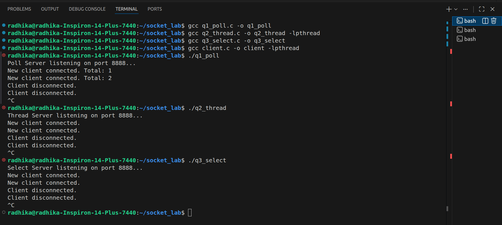
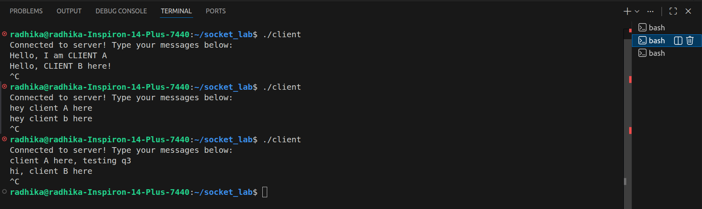
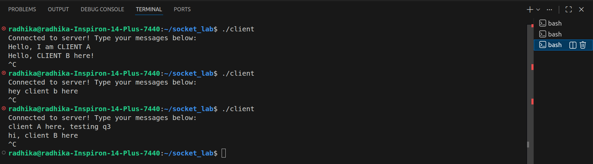

# Socket Programming-I Lab Assignment

**Name:** Radhika Agarwal 
**Roll Number:** B23ES1027  

## Assignment Overview
This project implements a multi-client TCP chat server and a universal TCP client. The server is designed to allow multiple clients to connect simultaneously and exchange messages in real time. To demonstrate different concurrency models, the server logic has been implemented in three distinct ways:

1. Using the `poll()` system call.
2. Using Multithreading (`pthreads`).
3. Using the `select()` system call.

---

## Concepts and Code Explanation

### 1. The Universal Client (`client.c`)
The client program connects to the server over IPv4 via a specified port. It utilizes two threads to handle simultaneous reading and writing:

* **Main Thread:** Continuously reads user input from the terminal and sends it to the server.
* **Listener Thread:** Continuously waits for incoming broadcasted messages from the server and prints them to the terminal.

### 2. Server 1: `poll()` (`q1_poll.c`)
This server handles concurrent client connections using I/O multiplexing without multithreading or multiprocessing.

* **Concept:** It uses an array of `pollfd` structures to monitor multiple file descriptors (sockets) simultaneously. The server blocks on the `poll()` system call until one or more sockets are ready for I/O operations.
* **Execution:** When the master listening socket has activity, the server accepts the new incoming TCP connection and adds it to the monitored array. When a client socket has activity, it reads the message and broadcasts it to all other connected clients, excluding the sender. Client disconnections are gracefully handled by removing the socket from the array.

### 3. Server 2: Multithreading (`q2_thread.c`)
This server utilizes the POSIX threads (`pthreads`) library to achieve concurrency.

* **Concept:** Instead of a single thread managing everything, the main server process continuously listens for incoming TCP connections. 
* **Execution:** For each newly connected client, the server creates a separate, dedicated thread to handle all communication with that specific client. A global array keeps track of active client sockets. To prevent race conditions when broadcasting messages or handling disconnections, a `pthread_mutex_lock` is used to safely access and modify the shared client array.

### 4. Server 3: `select()` (`q3_select.c`)
Similar to `poll()`, this server uses I/O multiplexing without multithreading.

* **Concept:** It utilizes the older `select()` system call to monitor the listening socket and all connected client sockets for incoming data.
* **Execution:** It maintains an `fd_set` (a bit array representing file descriptors). The server uses `FD_ISSET()` to determine which sockets are ready for reading. It broadcasts messages to all other clients and dynamically manages the set of active sockets using `FD_CLR()` upon graceful disconnections.

---

## Input and Output Format
As per the assignment requirements, the input and output formats have been kept simple and are documented below:

* **Input:** The user types standard text messages into the client terminal and presses `Enter`. The input is read as a standard C string terminated by a newline character.
* **Output:** Incoming messages are broadcasted by the server and printed directly to the standard output (`stdout`) of all other connected clients. The server acts as a pure broadcaster and does not alter the message contents.

---

## Compilation Instructions
To compile the source code files, ensure you have `gcc` installed. Open your terminal in the project directory and execute the following commands. *Note: The client and thread server require the `-lpthread` flag to link the threading library.*

```bash
# Compile the Client
gcc client.c -o client -lpthread
```

```bash
# Compile Server 1 (Poll)
gcc q1_poll.c -o q1_poll
```

```bash
# Compile Server 2 (Multithreading)
gcc q2_thread.c -o q2_thread -lpthread
```

```bash
# Compile Server 3 (Select)
gcc q3_select.c -o q3_select
```

```bash
## Running Instructions
You must start a server first before connecting any clients.
```

**Step 1: Start the Server**  
Open a terminal and run ONE of the compiled server executables:
```bash
./q1_poll
./q2_thread
./q3_select

**Step 2: Start the Clients**  
Open multiple new terminal windows. In each new window, run the client executable to connect to the active server:
```bash
./client

**Step 3: Test the Chat**  
Type a message into one of the client terminals and press Enter. You will see the message instantly appear in all other connected client terminals. Press Ctrl+C in a client terminal to test graceful disconnection.

## Testing Screenshots
1. 
2. 
3. 

